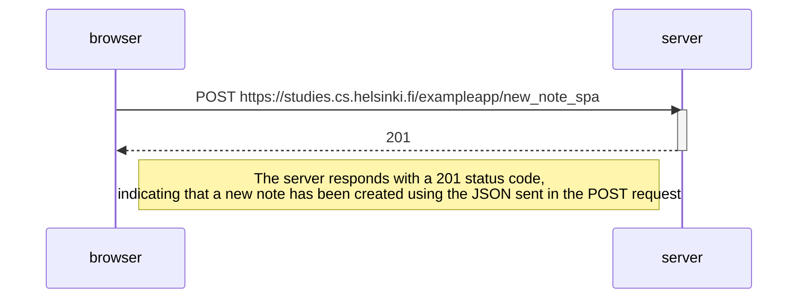

# New Note in Single Page App Diagram
Instead of sending a new note to the server, then letting the server add it to the array before rerequesting every single file or document, the single page app instead just updates the list of notes locally on the browser using JavaScript, and sends the new note to the server once so the server can just update its own array separately.

